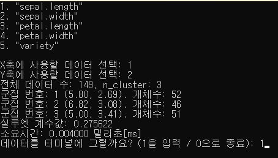

# C언어로 K-means++ 알고리즘 구현

#### 1. 구현 순서
- CSV 파일을 데이터로 받아오기
- K-MEANS++알고리즘에 따라 직접 K개의 Centroid로 설정 (CUDA)
- 클러스터링을 하여 유크리드 거리 계산으로 Centroid의 위치를 이동 (CUDA)
- Centroid의 위치가 이동하기 전과 동일할 때까지 클러스터링 
- kmeans 평가 중의 하나인 실루엣 분석을 구현 (CUDA)
- 결과를 출력
#### 2. 실행 방법
```
.\KmeansAlgoritmC.exe iris.csv
```

#### 3. 실행 결과
##### 결과 1 (iris.csv)


##### 결과 2 (spotify-2023.csv)


#### 4. 쿠다 사용 전과 후 비교
<table style="text-align:center">
    <tr>
        <th rowspan="2">데이터 셋</th>
        <th rowspan="2">데이터 양</th>
        <th rowspan="2">실루엣 계수값</th>
        <th>사용 전</th>
        <th>사용 후</th>
    </tr>
    <tr>
        <th colspan="2">소요 시간 (밀리초)</th>
    </tr>
    <tr> 
        <th> iris.csv </th>
        <td> 149 </td>
        <td> 0.274369 </td>
        <td> 0.004 </td>
        <td> TBD </td>
    </tr>
    <tr>
        <th> spotify-2023.csv </th>
        <td> 944 </td>
        <td> 0.297921 </td>
        <td> 0.059 </td>
        <td> TBD </td>
    </tr>
    <tr>
        <th> random_data.csv </th>
        <td> 10000 </td>
        <td> 0.285304 </td>
        <td> 6.068 </td>
        <td> TBD </td>
    </tr>
</table>

|| 파일 크기 |
|:---:|:---:|
| CUDA 사용 전 | 91 KB |
| CUDA 사용 후 | TBD |
